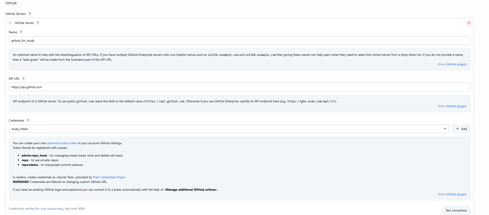
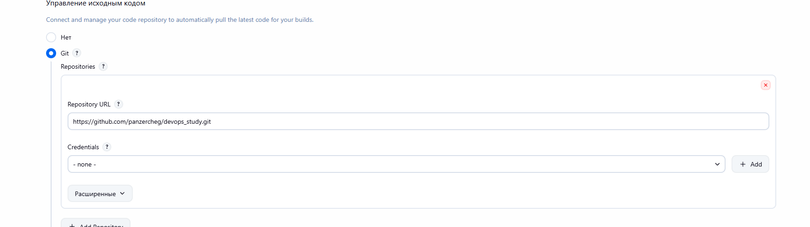

1) Создать токен в github https://github.com/settings/tokens
2) Настроить токен для github servers ( jenkins-web-url/manage/configure )
3) нужно для хуков, настроек и т.п. 
4) в билдах настраивается git repo ( для github repo public достаточно просто урла, для ssh/private нужно указывать ssh-ключ ) 