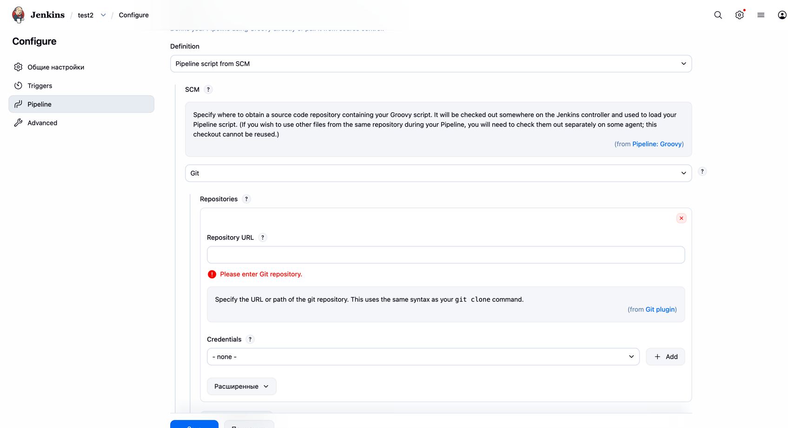
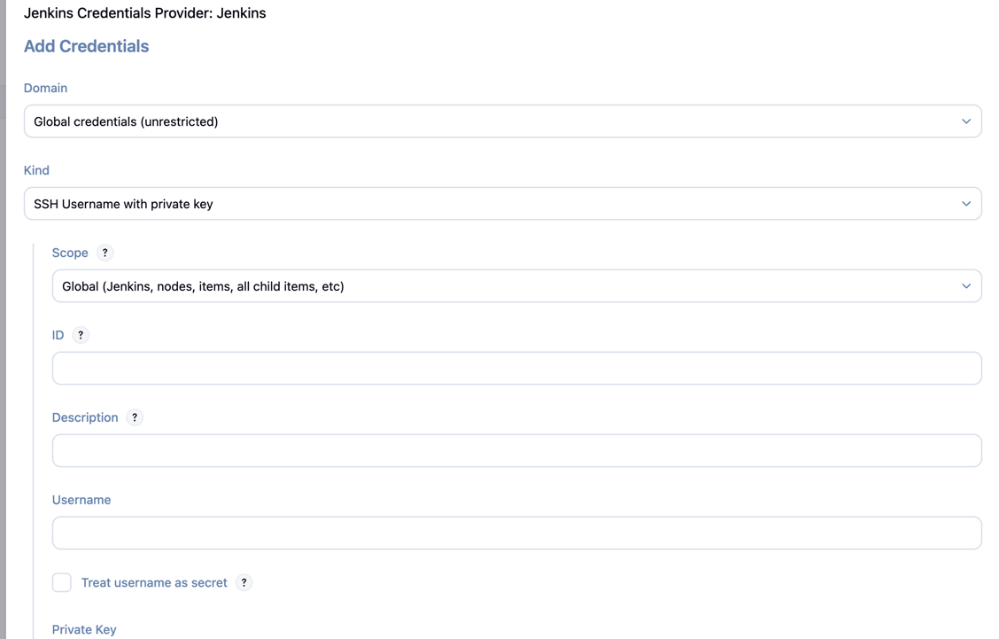

1) Создать токен в github https://github.com/settings/tokens
2) Настроить токен для github servers ( jenkins-web-url/manage/configure )
3) нужно для хуков, настроек и т.п. 
4) в билдах настраивается git repo ( для github repo public достаточно просто урла, для ssh/private нужно указывать ssh-ключ ) 
5) Создать pipeline джоб и в нём сделать по аналогии с scripts/Jenkinsfile и scripts/declarative_scm джоб, который будет качать приватное репо ( добавить ssh ключ для этого репозиторий в jenkins ), и джоба, которая будет через cat выводить данные в любом файле репозитоия
6) Создать или использовать любое текущее репо, где будут лежать файлы для скриптового дженкинса ( на языке Groovy ) - желательно в формате, чтобы там был каталог scripts/ а внутри файлы ( по аналогии с scripts/ScriptedJenkinsfile ) на груви
7) Создать пайплайн джобу и в ней выбрать pipeline from scm  и добавить credentials SSH 
8) Создать/залить репо со своим проектом на гитхаб ( приватное ) и в скриптовом пайплайне сделать его скачивание как в пункте 5
9) Добавить шаг в начале джоба, который будет переопределять название джоба- в название вывести название приватного репа + номер запуска билда в дженкинсе ( "название-твоего-приватного-репо-с-проектом_номер-сборки"), для этого использовать в нотации ниже
```
node {
   currentBuild.displayName = "$yournamevariable-$another"
   currentBuild.description = "$yourdescriptionvariable-$another"
   } 
```
